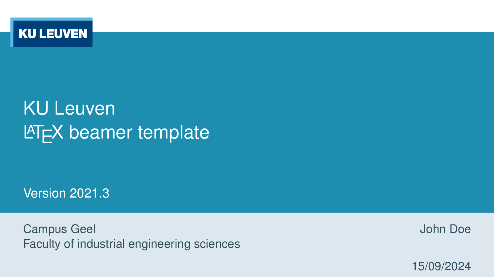
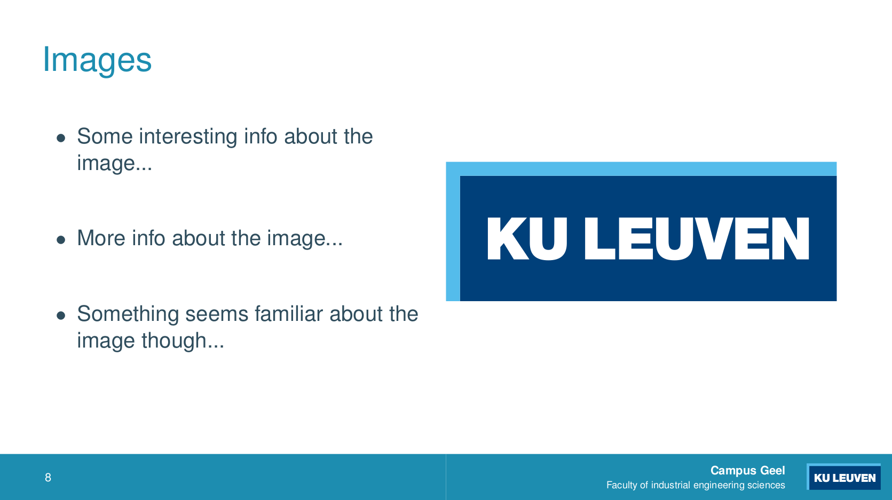
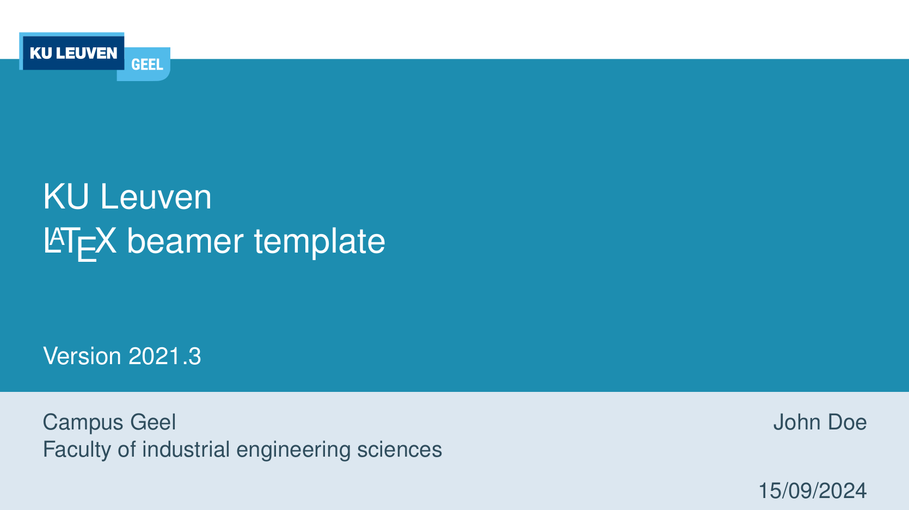

# KU Leuven LaTeX beamer template

This is a template to create a KU Leuven presentation with LaTeX.

> **WARNING**: This is a development release, please see the
> "[Releases](https://gitlab.kuleuven.be/campus-geel/templates/latex-ku-leuven-beamer/-/releases)"
> page for stable versions or checkout a git tag!

## Table of Contents

* [Requirements](#requirements)
* [Examples](#examples)
* [Frequently Asked Questions](#frequently-asked-questions)
  * [Why does the version number not correspond with the release date?](#why-does-the-version-number-not-correspond-with-the-release-date)
  * [Are there LaTeX templates for the pre 2021 style?](#are-there-latex-templates-for-the-pre-2021-style)
* [License](#license)

## Requirements

* A LaTeX distribution (e.g.: texlive) 
  Debian based systems: `apt-get install texlive-latex-base texlive-latex-recommended texlive-latex-extra`
* Python3 pygments (used by minted) 
  Debian based systems: `apt-get install python3-pygments`

## Examples

**Title page**

  
**Standard page with an image**

  
**Template with KU Leuven Geel logo (by using `\usetheme[logo=geel]{KUL}`)**

## Frequently Asked Questions

### Why does the version number not correspond with the release date?

The version number (currently `v2021.x`) corresponds with the release date of the equivalent
official PowerPoint style. This repository holds the style of 2021. Major corrections and additions
are indicated by the number behind the dot (i.e. `.x`).

### Are there LaTeX templates for the pre 2021 style?

We found one on [github by jgawad](https://github.com/jgawad/KULeuvenStijl/tree/master), which might
be what you are looking for.

## License

The LaTeX code for this template is open-source and is licensed as [GPLv3](LICENSE). However, the KU
Leuven logo and layout are (probably) copyrighted by KU Leuven.
